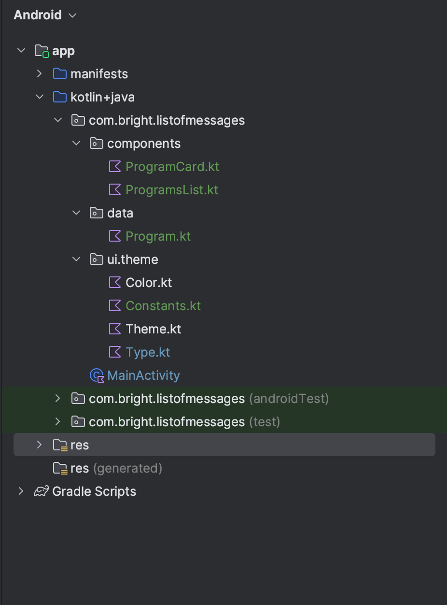

[//]: # (![img.png]&#40;img.png&#41;)

[//]: # (![structure.png]&#40;structure.png&#41;)

This is my folder structure. 

I created a components directory to put my (ideally) reusable components. ProgramList is a component that takes in a list of programs and displays them in a list.
It takes a composable function as an argument to render each item in the list. basically allowing us to use a different component for each child, in this case program.

I overridden a few typography inside Type.kt to make it easier to use typography in the app.
I created a Constants.kt file to store all the constants used in the app. example padding, border..

I put a data class in the data directory to represent the program object. I also created a fake data source to simulate a real data source.

